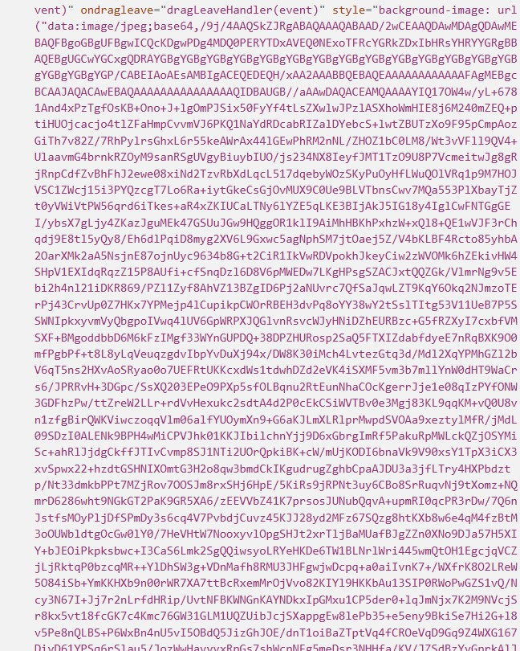

# List of all found bugs
1. Wanneer je stappen aan het toevoegen bent en voegt nog een stap toe verwijderd die al je vorige stappen.
2. Image icon in het toevoeg scherm is ni gecentreerd
3. Waneer je een foto insleept krijg ik een "PayloadTooLargeError". Als ik dan in de gerenderede html inspect, zie ik da die ni gwn de .png daar zet maar echt die foto als data. Da is denk ik de reden voor die error. Ik snap uw dragdrop ni dus kan ni echt aanpassen.  
